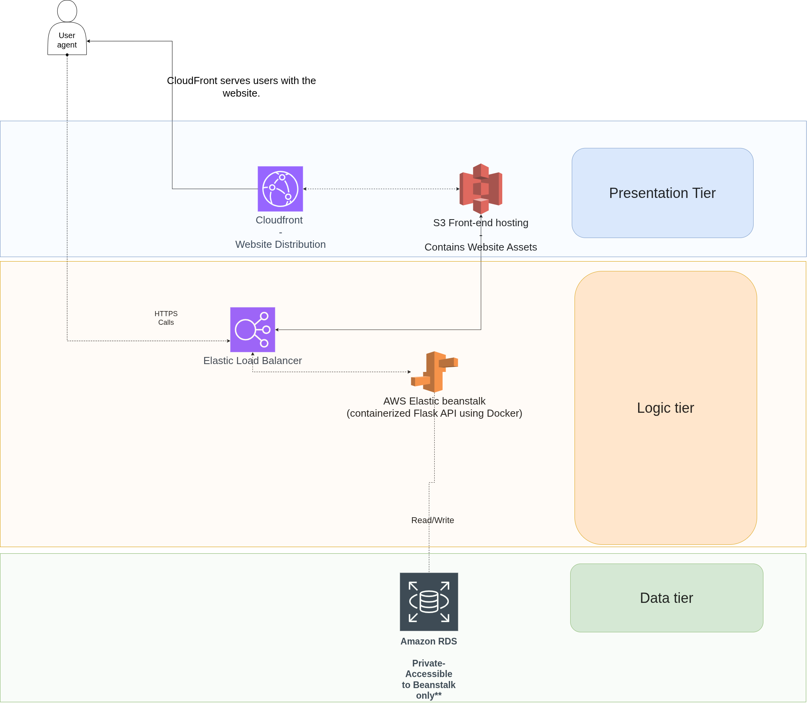

# AWS 3-Tier Inventory Management System

A cloud-based inventory management system designed with a 3-tier architecture — frontend, backend, and database — deployed on AWS Elastic Beanstalk using Docker and automated through GitHub Actions CI/CD.

---

## Architecture Overview

### Tiers
1. **Presentation Layer**  
   - Frontend built with React (or HTML/CSS/JS)  
   - Hosted on Amazon S3  
   - Distributed globally via Amazon CloudFront

2. **Application Layer**  
   - Backend built with Flask (Python)  
   - Containerized using Docker  
   - Deployed on AWS Elastic Beanstalk (Docker Environment)  
   - Serves API endpoints for inventory CRUD operations

3. **Data Layer**  
   - Amazon RDS (MySQL or PostgreSQL)  
   - Private subnet for secure data storage  
   - Access restricted to Elastic Beanstalk instances

---

## Project Structure

```
furniture-inventory/
│
├── app.py
├── requirements.txt
├── Dockerfile
│
├── templates/
│   ├── index.html
│   └── summary.html
│
└── static/
    └── background.jpg

```
## Architecture Diagram



---

## AWS Services Used

| Layer | AWS Service | Purpose |
|-------|--------------|----------|
| Frontend | S3 | Host static website |
| Frontend | CloudFront | Content delivery network |
| Backend | Elastic Beanstalk | Application hosting and scaling |
| Database | RDS | Managed database |
| CI/CD | GitHub Actions | Automate build and deploy |
| Networking | VPC, Security Groups, Load Balancer | Network isolation and security |

---

## Deployment Flow

1. Developer pushes code to GitHub.  
2. GitHub Actions builds and tests the Docker image.  
3. The image is deployed automatically to Elastic Beanstalk.  
4. Elastic Beanstalk serves the application through a load balancer.  
5. Application connects securely to the RDS database.  
6. Frontend assets are served via CloudFront + S3.

---

## Local Development Setup

### Backend
```bash
cd backend
python -m venv venv
source venv/bin/activate
pip install -r requirements.txt
python app.py
```

### Docker Run (local test)
```bash
docker build -t inventory-app .
docker run -p 80:80 inventory-app
```

### Frontend
```bash
cd frontend
npm install
npm start
```

---

## Environment Variables

Create an `.env` file or configure these in Elastic Beanstalk:

```
DB_HOST=<rds-endpoint>
DB_USER=<username>
DB_PASSWORD=<password>
DB_NAME=<database-name>
SECRET_KEY=<flask-secret-key>
```

---

## CI/CD with GitHub Actions

GitHub Actions automatically triggers on code push:
- Builds Docker image  
- Runs tests  
- Deploys to Elastic Beanstalk via AWS CLI credentials stored as secrets  

Secrets required:
```
AWS_ACCESS_KEY_ID
AWS_SECRET_ACCESS_KEY
AWS_REGION
EB_APP_NAME
EB_ENV_NAME
```

---

## Future Enhancements
- Add authentication and user roles  
- Implement caching with AWS ElastiCache  
- Use Terraform for infrastructure as code  
- Add monitoring with AWS CloudWatch  

---

## License
This project is open source and available under the MIT License.
````

